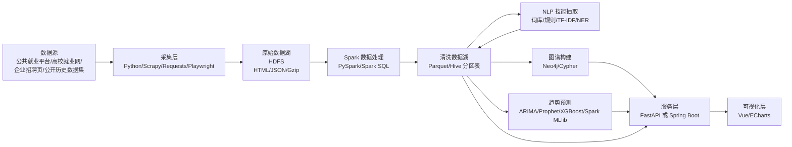

# 基于 Spark 与知识图谱的高校毕业生就业技能需求分析与趋势预测系统技术设计文档

版本：V1.0  
日期：2026-06-17  
关联文档：[需求文档.md](./需求文档.md)

---

## 1. 文档目的

本文档用于说明系统实施阶段需要使用的技术、各技术在系统流程中的使用位置、运行环境要求、数据存储方案，以及招聘数据样本规模和存储容量估算。

本系统数据来自多源招聘信息，包含结构化字段和大量岗位描述文本。由于后续需要进行 Spark 批处理、NLP 技能抽取、知识图谱构建和趋势预测，系统不建议只使用本地文件夹或单一 MySQL 存储全部数据，而应采用“HDFS 数据湖 + 关系数据库 + 图数据库 + 模型文件存储”的组合架构。

## 2. 总体技术路线

系统整体技术路线如下：



## 3. 各阶段技术选型

| 阶段 | 主要任务 | 推荐技术 | 说明 |
| --- | --- | --- | --- |
| 数据源配置 | 管理采集平台、城市、岗位关键词、采集频率 | YAML/JSON 配置文件、PostgreSQL/MySQL | 配置数据源、关键词和城市，不把这些写死在代码里 |
| 数据采集 | 请求页面、解析列表页和详情页、记录采集日志 | Python、Scrapy、Requests、BeautifulSoup、Playwright | Requests 适合静态页面，Playwright 只用于必要的动态页面，不绕过登录/验证码 |
| 任务调度 | 定时采集、失败重试、采集批次管理 | APScheduler、Airflow、cron、Redis 可选 | 毕设阶段可用 APScheduler；如果强调工程化，可用 Airflow |
| 原始数据存储 | 保存原始 HTML/JSON、采集批次、来源 URL | HDFS、gzip/jsonl | 原始数据不可直接丢弃，后续抽取规则变化时可重跑 |
| 数据清洗 | 去重、字段标准化、薪资解析、日期解析、岗位分类 | PySpark、Spark SQL、正则表达式、UDF | 体现 Spark 在大规模文本和结构化数据批处理中的作用 |
| 清洗结果存储 | 保存清洗后的岗位宽表、岗位-技能关系表、月度统计表 | HDFS、Parquet、Hive Metastore | Parquet 适合列式分析，Hive Metastore 管理表和分区 |
| 技能词库构建 | 整理技能词、同义词、技能类别 | PostgreSQL/MySQL、CSV、YAML | 技能词库规模不大，放关系库或配置文件即可 |
| 技能抽取 | 从岗位描述中识别专业技能 | jieba/HanLP、TF-IDF、TextRank、正则、Transformers、PyTorch | 采用词库匹配 + 上下文规则 + 弱监督 NER 的组合 |
| 知识图谱构建 | 构建岗位、技能、城市、企业、行业、时间等节点和关系 | Neo4j、Cypher、Neo4j Python Driver | Neo4j 存图谱关系，不存大批量原始 HTML |
| 图谱分析 | 技能共现、核心技能、岗位关联技能分析 | Neo4j Graph Data Science 可选、NetworkX、Spark 统计 | 毕设中可先用 Spark 计算共现，再导入 Neo4j |
| 趋势预测 | 构建月度序列，预测未来岗位/技能热度 | pandas、statsmodels、Prophet、XGBoost、Spark MLlib | 先做移动平均基线，再做 ARIMA/Prophet/XGBoost |
| 后端接口 | 提供岗位查询、技能查询、图谱查询、预测结果接口 | FastAPI 或 Spring Boot | Python 技术栈更方便与 NLP/模型衔接，Java 技术栈更符合常见管理系统 |
| 前端可视化 | 展示岗位分布、技能热度、图谱、趋势预测 | Vue 3、ECharts、Element Plus | ECharts 支持地图、折线图、柱状图、关系图 |
| 模型与结果管理 | 保存模型、评估指标、预测结果 | HDFS、PostgreSQL/MySQL | 模型文件放 HDFS，预测结果放关系库方便接口查询 |

## 4. 分层数据架构

建议采用 Bronze/Silver/Gold 三层数据组织方式。

| 数据层 | 内容 | 存储位置 | 格式 |
| --- | --- | --- | --- |
| Bronze 原始层 | 原始 HTML、原始 JSON、采集日志、页面快照 | HDFS | `.html.gz`、`.jsonl.gz` |
| Silver 清洗层 | 清洗后的岗位表、公司表、岗位文本分段表 | HDFS + Hive Metastore | Parquet |
| Gold 应用层 | 月度需求统计、岗位-技能关系、技能共现、预测结果 | Parquet + PostgreSQL/MySQL | Parquet、关系表 |
| Graph 图谱层 | 实体节点、关系、图谱索引 | Neo4j | Neo4j 原生存储 |
| Model 模型层 | NLP 模型、预测模型、模型评估文件 | HDFS | `.pkl`、`.pt`、`.json` |

### 4.1 推荐目录结构

HDFS 推荐目录结构如下：

```text
/data/job_skill_lake/
  raw/
    source=ncss/dt=2026-06-17/city=beijing/*.jsonl.gz
  bronze/
    job_raw/source=ncss/dt=2026-06-17/*.parquet
  silver/
    job_posting_clean/month=2026-06/city=beijing/*.parquet
    job_text_segment/month=2026-06/*.parquet
  gold/
    job_skill_relation/month=2026-06/*.parquet
    monthly_job_demand/*.parquet
    monthly_skill_demand/*.parquet
    skill_cooccurrence/*.parquet
  graph_import/
    nodes/*.csv
    relationships/*.csv
  models/
    skill_ner/
    forecast/
```

### 4.2 为什么不建议只用本地存储

1. 招聘岗位详情页文本较长，原始 HTML/JSON 的体积明显大于清洗后的字段。
2. 趋势预测需要保留多个采集批次，重复快照会放大存储量。
3. Spark 更适合直接读取 HDFS 和 Parquet 这类面向批处理的数据存储。
4. 后续技能抽取规则、岗位分类规则变化时，需要从原始数据重跑处理流程。
5. Neo4j、关系库、模型文件和原始数据的存储特点不同，不适合混在一个本地目录或单一数据库中。

### 4.3 推荐存储组合

| 数据类型 | 不推荐 | 推荐 |
| --- | --- | --- |
| 原始 HTML/JSON | MySQL 大字段、本地散乱文件 | HDFS，压缩保存 |
| 清洗后的岗位宽表 | Excel、CSV 长期保存 | Parquet 分区表 |
| 技能词库、任务状态 | HDFS 文本文件 | PostgreSQL/MySQL |
| 岗位-技能图关系 | 只用关系表查询 | Neo4j + 关系表备份 |
| 趋势预测训练样本 | 前端临时 JSON | Parquet + PostgreSQL 聚合表 |
| 模型文件 | 项目代码目录 | HDFS 的 models 目录 |

## 5. 数据规模估算

### 5.1 采集范围假设

当前需求文档中的核心实施城市为 10 个：

```text
北京、上海、广州、深圳、杭州、南京、武汉、成都、重庆、西安
```

可选扩展城市为 2 个：苏州、长沙。首版不建议同时加入全部扩展城市，避免数据采集和清洗规模过大。

岗位关键词分三档：

| 档位 | 岗位数量 | 示例 |
| --- | --- | --- |
| 核心岗位 | 8 个 | 数据分析师、BI 分析师、数据开发工程师、大数据开发工程师、数据仓库工程师、Python 开发工程师、机器学习工程师、算法工程师 |
| 可选对照岗位 | 1 个 | Java 开发工程师 |
| 暂不采集岗位 | 不纳入首版 | 前端、测试、产品、运营、DBA、DevOps、云计算、数据治理等 |

数据源按 3 个自采入口估算，实施顺序如下：

| 层级 | 数据源 | 覆盖范围 | 实施建议 |
| --- | --- | --- | --- |
| 主采集源 | 重庆人才网 | 重庆 | 承担重庆岗位主体样本，先实现静态列表页、详情页和增量去重 |
| 主采集源 | 重庆市公共就业服务网 | 重庆 | 补充公共招聘和区县岗位，先用小样本确认页面字段与访问规则 |
| 补充采集源 | 重庆市普通高校毕业生智慧就业平台 | 重庆高校毕业生 | 补充校招和应届生岗位，不采集登录后或受限制内容 |
| 跨城对照源 | 国家大学生就业服务平台 | 其余 9 个核心城市 | 每个“城市-岗位”设置固定配额，避免大城市样本淹没重庆样本 |
| 历史预测源 | Job-SDF | 2021-2023 年历史序列 | 训练与评估预测模型，不计入首版自采压力，也不与自采样本直接混合统计 |

首版自采样本建议重庆占 50%-60%，其余 9 个城市合计占 40%-50%。采集器按数据源分别实现，保留 `source`、`source_job_id`、`source_url`、`crawl_time` 和 `publish_date`，清洗后再统一字段口径。

### 5.2 样本数量估算

样本量受平台开放程度、岗位热度、城市规模、关键词重复度影响较大。下面是规划估算，不代表每个平台都一定能采到同等规模。

| 场景 | 采集方式 | 原始记录数 | 去重后有效岗位数 | 适合用途 |
| --- | --- | ---: | ---: | --- |
| 原型验证 | 10 城市 x 4-6 岗位 x 1-2 数据源 | 3000-12000 | 2000-7000 | 验证采集、清洗、技能抽取流程 |
| 首版实施 | 10 城市 x 8 岗位 x 2 数据源 | 12000-35000 | 9000-22000 | 完成图谱和基础可视化 |
| 适度扩展 | 10 城市 x 10 岗位，或 12 城市 x 8 岗位 | 30000-65000 | 15000-38000 | 扩展对照岗位或扩展城市，二选一 |
| 趋势预测 | 公开历史样本 + 自采当前数据 | 自采 12000-35000，历史样本按数据集规模 | 自采 9000-22000 | 自采做当前画像，历史样本做预测训练和验证 |

毕业设计建议目标：

1. 自采数据：12000-35000 条原始记录，去重后 9000-22000 条有效岗位。
2. 图谱规模：岗位-技能关系达到 90000-220000 条即可满足展示和分析。
3. 趋势预测：优先使用公开历史样本补足 12-24 个按月时间点，自采数据用于当前市场画像和系统展示。

### 5.3 单条样本大小估算

| 数据形态 | 单条平均大小 | 说明 |
| --- | ---: | --- |
| 原始 HTML，未压缩 | 80KB-250KB | 详情页包含脚本、样式、推荐内容时会更大 |
| 原始 HTML/JSON，gzip 压缩后 | 20KB-80KB | 建议压缩保存原始数据 |
| 解析后 JSON | 3KB-8KB | 包含岗位字段、描述文本、来源信息 |
| 清洗后 Parquet | 1KB-3KB | 列式压缩后体积明显变小 |
| 岗位-技能关系 | 每岗位约 8-15 条关系 | 关系表体积取决于技能数量和证据片段长度 |

### 5.4 存储容量估算

| 场景 | 原始压缩数据 | 解析 JSON | 清洗 Parquet | Neo4j 图库 | 总容量建议 |
| --- | ---: | ---: | ---: | ---: | ---: |
| 原型验证，约 5000 原始记录 | 0.1GB-0.4GB | 0.02GB-0.05GB | 0.01GB-0.03GB | 0.1GB-0.3GB | 20GB 以上 |
| 首版实施，约 2 万原始记录 | 0.4GB-1.6GB | 0.08GB-0.2GB | 0.03GB-0.08GB | 0.3GB-1GB | 50GB 以上 |
| 适度扩展，约 5 万原始记录 | 1GB-4GB | 0.2GB-0.5GB | 0.05GB-0.15GB | 0.8GB-2GB | 100GB 以上 |
| 预测实验，公开历史样本 + 自采数据 | 视历史样本而定 | 0.2GB-1GB | 0.1GB-0.5GB | 1GB-3GB | 100GB-150GB |

注意：如果使用 HDFS 并设置 3 副本，原始数据实际占用大约会乘以 3。毕业设计环境可以将副本数设置为 1 或 2：单机伪分布式可用 1 副本；两到三台虚拟机可用 2 副本。

结论：收缩城市和岗位后，首版并不需要 300GB 以上空间。若使用 HDFS 存储原始数据、清洗 Parquet、图谱导入文件和模型文件，建议准备 100GB 左右可用空间；如果还要保存较多历史样本和多次重跑中间结果，建议准备 150GB。

## 6. 环境配置建议

### 6.1 开发环境

| 项目 | 推荐配置 |
| --- | --- |
| 操作系统 | Windows 11 + WSL2 Ubuntu 22.04/24.04，或直接使用 Ubuntu Server |
| Python | Python 3.10 或 3.11 |
| Java | JDK 17 |
| Spark | Spark 3.5.x 或 Spark 4.x；若追求稳定兼容，建议 Spark 3.5.x |
| Hadoop | Hadoop 3.3.x/3.4.x |
| 数据库 | PostgreSQL 16+ 或 MySQL 8 |
| 图数据库 | Neo4j 5 LTS |
| 前端环境 | Node.js 20/22 LTS、Vue 3、ECharts |
| 容器 | Docker、Docker Compose |
| IDE | PyCharm、VS Code、IntelliJ IDEA |

开发阶段可在本机使用 Docker Compose 启动 PostgreSQL、Neo4j、Redis 等服务；HDFS 可先使用单机伪分布式模式，Spark 可使用 local 模式或 standalone 模式。

### 6.2 原型硬件配置

适合 3000-20000 条有效岗位数据：

| 资源 | 最低配置 | 推荐配置 |
| --- | ---: | ---: |
| CPU | 4 核 | 8 核 |
| 内存 | 16GB | 32GB |
| 磁盘 | 100GB SSD | 150GB-300GB SSD |
| 部署方式 | Spark local + HDFS 伪分布式 | Spark standalone + HDFS 伪分布式 |

### 6.3 完整毕设硬件配置

适合 3 万-6 万级原始记录或后续适度扩展：

| 节点 | CPU | 内存 | 磁盘 | 部署组件 |
| --- | ---: | ---: | ---: | --- |
| 单机增强版 | 8-12 核 | 32GB | 200GB-300GB SSD/HDD | HDFS 伪分布式、Spark standalone、PostgreSQL、Neo4j |
| 主节点 | 4-8 核 | 16GB | 150GB-200GB | NameNode、ResourceManager、Hive Metastore、调度服务 |
| 工作节点 x 2 | 4-8 核 | 16GB-32GB | 200GB-300GB | DataNode、NodeManager、Spark Worker |
| 数据库节点，可合并 | 4-8 核 | 16GB | 150GB-300GB | PostgreSQL、Neo4j |

如果条件有限，推荐使用“单机伪分布式 HDFS + Spark standalone + PostgreSQL + Neo4j”的方式；如果学校提供虚拟机或服务器，可以使用 1 主 2 从的小型 Hadoop 集群。

## 7. HDFS 存储方案

适用场景：

1. 学校课程或论文要求体现 Hadoop 大数据生态。
2. 需要展示分布式存储、Spark on YARN、Hive 表管理。
3. 需要避免本地文件散乱存储，同时保留原始数据可追溯、可重跑。

优点：

1. 与 Spark、Hive、YARN 集成自然。
2. 适合大文件、批处理和顺序读写。
3. 论文中容易解释“大数据技术路线”。

约束：

1. 集群搭建和维护成本较高。
2. 多副本占用磁盘空间较多。
3. 对单机毕业设计来说略重，因此本项目已通过缩减城市和岗位范围控制数据量。

推荐结论：

| 实施方式 | 推荐组合 | 适合情况 |
| --- | --- | --- |
| 单机伪分布式 | HDFS + Spark standalone + Hive Metastore + PostgreSQL + Neo4j | 个人电脑或单台服务器完成毕业设计 |
| 小型集群 | HDFS + YARN + Spark + Hive Metastore + PostgreSQL + Neo4j | 学校提供多台虚拟机或服务器 |

本项目最终采用 HDFS 作为主数据存储。原始数据、清洗后的 Parquet、图谱导入文件、模型文件均存入 HDFS；PostgreSQL/MySQL 只保存配置、任务日志、词库和可视化所需的聚合结果；Neo4j 只保存图谱节点和关系。

## 8. 数据表与文件格式设计

### 8.1 Parquet 分区表

| 表名 | 用途 | 分区字段 |
| --- | --- | --- |
| `job_raw_parsed` | 解析后的原始岗位数据 | `source`、`dt` |
| `job_posting_clean` | 清洗后的岗位宽表 | `month`、`city`、`source` |
| `job_text_segment` | 岗位职责、任职要求、福利等文本分段 | `month`、`occupation_category` |
| `job_skill_relation` | 岗位-技能关系 | `month`、`occupation_category` |
| `monthly_job_demand` | 月度岗位需求统计 | `month`、`city` |
| `monthly_skill_demand` | 月度技能需求统计 | `month`、`occupation_category` |
| `skill_cooccurrence` | 技能共现统计 | `month`、`occupation_category` |

### 8.2 关系数据库表

关系库不保存大规模原始页面，主要保存系统运行和接口查询需要的数据。

| 表名 | 用途 |
| --- | --- |
| `data_source` | 数据源配置 |
| `crawl_task` | 采集任务配置 |
| `crawl_log` | 采集日志和失败信息 |
| `skill_dictionary` | 技能词库 |
| `skill_alias` | 技能同义词 |
| `occupation_category` | 岗位分类体系 |
| `forecast_result` | 预测结果 |
| `model_evaluation` | 模型评估指标 |
| `dashboard_cache` | 可视化聚合结果缓存 |

### 8.3 Neo4j 图谱数据

| 节点/关系 | 数据来源 |
| --- | --- |
| `(:JobPosting)` | `job_posting_clean` |
| `(:Occupation)` | `occupation_category` |
| `(:Skill)` | `skill_dictionary`、`job_skill_relation` |
| `(:City)` | 城市标准表 |
| `(:Company)` | 岗位企业字段 |
| `(:TimeMonth)` | 月度统计结果 |
| `(:JobPosting)-[:REQUIRES]->(:Skill)` | `job_skill_relation` |
| `(:Skill)-[:CO_OCCURS_WITH]->(:Skill)` | `skill_cooccurrence` |
| `(:Occupation)-[:HAS_HOT_SKILL]->(:Skill)` | 月度技能 Top N |

## 9. 关键处理流程与技术落点

### 9.1 数据采集流程

```text
读取采集配置
  -> 生成 source + city + keyword 任务
  -> 请求列表页
  -> 解析详情页 URL
  -> 请求详情页
  -> 保存原始页面到 HDFS
  -> 解析基础字段到 JSON
  -> 写入采集日志
```

技术落点：

1. Scrapy 负责批量采集和失败重试。
2. Requests/BeautifulSoup 负责普通页面解析。
3. Playwright 只处理必须渲染的公开页面。
4. 原始页面保存到 HDFS，解析结果写入 Bronze 层。
5. PostgreSQL/MySQL 记录采集批次、任务状态、错误原因。

### 9.2 Spark 清洗流程

```text
读取 Bronze 原始解析数据
  -> 去重
  -> 过滤无效岗位
  -> 标准化城市/薪资/学历/经验
  -> 岗位名称归一化
  -> 文本分段
  -> 写入 Silver Parquet
```

技术落点：

1. Spark SQL 负责大规模筛选、聚合、去重。
2. PySpark UDF 负责薪资解析、日期解析、岗位名称归一化。
3. Parquet 分区表保存清洗结果。
4. Hive Metastore 管理表结构和分区。

### 9.3 技能抽取流程

```text
读取岗位描述和任职要求
  -> 文本清洗
  -> 技能词库匹配
  -> 技术名词正则匹配
  -> TF-IDF/TextRank 候选发现
  -> 上下文过滤
  -> NER 模型识别
  -> 技能归一化
  -> 输出岗位-技能关系
```

技术落点：

1. jieba/HanLP 用于中文分词和词性分析。
2. 正则表达式用于识别英文技能、版本号、技术组合词。
3. TF-IDF/TextRank 用于发现岗位文本中的高频候选技能。
4. Transformers/PyTorch 用于训练或微调中文 NER 模型。
5. Spark 负责将抽取逻辑批量应用到岗位数据。

### 9.4 知识图谱构建流程

```text
读取岗位表、技能表、关系表
  -> 生成节点 CSV
  -> 生成关系 CSV
  -> 导入 Neo4j
  -> 创建索引
  -> 计算技能共现和热门技能
  -> 提供 Cypher 查询接口
```

技术落点：

1. Spark 生成 Neo4j 导入所需节点和关系文件。
2. Neo4j 存储岗位-技能-城市-企业-时间关系。
3. Cypher 提供图查询。
4. NetworkX 或 Neo4j GDS 可用于技能中心性分析。

### 9.5 趋势预测流程

```text
读取月度岗位和技能需求统计
  -> 构建时间序列
  -> 缺失值处理和平滑
  -> 划分训练集/验证集/测试集
  -> 训练基线模型
  -> 训练 ARIMA/Prophet/XGBoost
  -> 评估 MAE/RMSE/SMAPE
  -> 写入预测结果表
```

技术落点：

1. Spark 汇总月度序列。
2. pandas/statsmodels/Prophet/XGBoost 负责建模。
3. Spark MLlib 可用于补充机器学习模型和特征处理。
4. PostgreSQL/MySQL 保存最终预测结果，方便前端查询。

## 10. 实施优先级

建议按以下顺序实施，避免一开始搭建过重环境导致进度拖慢：

1. 先用本地小样本跑通采集、清洗、技能抽取。
2. 搭建 HDFS，把原始数据和 Parquet 数据迁过去。
3. 使用 Spark local/standalone 重跑清洗流程。
4. 构建技能词库和岗位-技能关系表。
5. 导入 Neo4j，完成图谱查询。
6. 使用公开历史样本或按 publish_date 构建月度序列。
7. 训练预测模型，保存预测结果。
8. 开发后端和前端可视化。

## 11. 推荐最终技术栈

如果需要在论文和答辩中表达得清晰，建议最终采用如下技术栈：

| 模块 | 技术 |
| --- | --- |
| 编程语言 | Python、JavaScript/TypeScript |
| 数据采集 | Scrapy、Requests、BeautifulSoup、Playwright |
| 大数据处理 | Apache Spark、PySpark、Spark SQL |
| 分布式存储 | HDFS |
| 数据湖格式 | Parquet、Hive Metastore |
| 关系数据库 | PostgreSQL 或 MySQL |
| 图数据库 | Neo4j |
| NLP | jieba/HanLP、scikit-learn、Transformers、PyTorch |
| 预测模型 | 移动平均、ARIMA、Prophet、XGBoost、Spark MLlib |
| 后端服务 | FastAPI |
| 前端可视化 | Vue 3、ECharts、Element Plus |
| 部署 | Docker、Docker Compose，必要时使用多节点虚拟机 |

## 12. 参考资料

1. Apache Spark 官方文档：https://spark.apache.org/docs/latest/
2. Apache Hadoop HDFS Architecture：https://hadoop.apache.org/docs/stable/hadoop-project-dist/hadoop-hdfs/HdfsDesign.html
3. Apache Hive 官方网站：https://hive.apache.org/
4. Apache Parquet 官方文档：https://parquet.apache.org/docs/
5. Neo4j Cypher Manual：https://neo4j.com/docs/cypher-manual/current/
6. PostgreSQL 官方文档：https://www.postgresql.org/docs/current/
7. ClickHouse 官方文档：https://clickhouse.com/docs
8. Apache ECharts 官方网站：https://echarts.apache.org/
