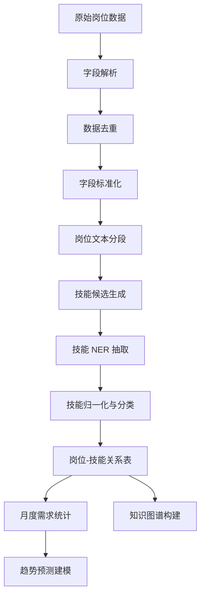

# 基于 Spark 与知识图谱的高校毕业生就业技能需求分析与趋势预测系统需求文档

版本：V1.0  
日期：2026-06-17  
适用对象：数据科学与大数据技术专业毕业设计

---

## 1. 项目背景

高校毕业生在求职过程中常面临两个问题：一是不清楚目标岗位真正需要哪些专业技能；二是不知道不同岗位、不同城市、不同时间阶段的技能需求是否在变化。招聘平台和高校就业平台中存在大量岗位信息，但这些信息通常以非结构化文本形式分散存在，岗位描述中很少直接提供“专业技能字段”，学生需要人工阅读大量岗位详情才能获得判断。

本系统拟基于多源招聘数据，利用 Spark 完成招聘数据清洗、标准化和统计分析，利用自然语言处理技术从岗位描述中抽取专业技能，并基于 Neo4j 等图数据库构建“岗位-技能-城市-行业-时间”知识图谱。在此基础上，对岗位需求和技能需求进行趋势分析与短期预测，并通过可视化系统展示给高校毕业生、就业指导老师和专业建设人员。

## 2. 项目名称

基于 Spark 与知识图谱的高校毕业生就业技能需求分析与趋势预测系统

## 3. 建设目标

1. 构建多源招聘数据采集与存储流程，形成可复用的岗位数据集。
2. 使用 Spark 对招聘数据进行批处理清洗、字段标准化、去重和聚合分析。
3. 从岗位描述、任职要求、岗位职责等非结构化文本中自动抽取专业技能。
4. 构建就业技能知识图谱，表达岗位、技能、城市、行业、学历、经验、薪资之间的关系。
5. 形成岗位需求热度和技能需求热度的时间序列，进行短期趋势预测。
6. 实现可视化系统，支持岗位分析、技能分析、知识图谱查询和趋势预测展示。

## 4. 用户角色

| 用户角色 | 主要诉求 |
| --- | --- |
| 高校毕业生 | 了解目标岗位需要掌握哪些技能，判断学习优先级 |
| 就业指导老师 | 了解就业市场变化，为学生提供就业指导 |
| 专业负责人/教师 | 观察市场技能需求变化，为课程建设提供参考 |
| 系统管理员 | 维护数据采集、清洗、模型训练和系统配置 |

## 5. 数据来源与可行性分析

### 5.1 权威基准与历史数据源

权威统计数据和岗位明细数据的用途不同：前者用于宏观背景、职业分类和结果校验，后者才用于技能抽取和知识图谱构建。二者不能相互替代。

| 数据源 | 主要内容 | 本系统用途 | 说明 |
| --- | --- | --- | --- |
| 国家统计局“国家数据” | 就业人员、城镇调查失业率、行业与地区经济指标 | 论文背景分析、城市层面的外生特征和预测结果校验 | 权威性高，但不含岗位描述和具体技能，不能作为图谱的主数据 |
| 人力资源和社会保障部、中国就业网 | 就业政策、职业供求分析、公共就业服务信息 | 解释岗位需求变化、辅助验证职业冷热趋势 | 适合宏观佐证，不适合直接抽取岗位技能 |
| 《中华人民共和国职业分类大典（2022年版）》及国家职业标准 | 标准职业名称、职业编码、职业定义 | 统一岗位名称，建立“原始岗位名-标准职业”映射 | 作为岗位本体和分类依据，减少人为分类的主观性 |
| Job-SDF | 基于中国招聘广告构建的 2021-2023 年月度技能需求数据，覆盖 2324 类技能和 521 家企业 | 训练和评估趋势预测模型，提供历史时间序列 | 学术公开数据集，适合预测基准；其口径与自采数据不同，结果应分别展示或经过口径对齐后再比较 |

### 5.2 推荐自采岗位数据源

| 优先级 | 数据源 | 可采字段 | 可行性与定位 |
| --- | --- | --- | --- |
| P0 主源 | 重庆人才网 | 岗位名称、企业、区县、薪资、学历、经验、岗位描述、岗位类别等 | 重庆本地岗位覆盖较强，公开页面结构较清晰，适合作为重庆主采集源；批量采集前仍应联系平台或取得学校研究授权 |
| P0 主源 | 重庆市公共就业服务网 | 公共招聘岗位、招聘会、企业和地区信息 | 重庆市人社公共就业服务入口，权威性较高；先用少量页面验证详情字段和访问稳定性 |
| P1 补充 | 重庆市普通高校毕业生智慧就业平台 | 校园招聘、宣讲会、毕业生岗位和企业信息 | 与高校毕业生主题最贴合，用于补充应届生岗位；动态页面或登录内容不绕过访问限制 |
| P1 跨城对照 | 国家大学生就业服务平台 | 校招、实习、联合招聘、岗位详情、学历、薪资、城市、企业等 | 用于北京、上海、广州、深圳、杭州、南京、武汉、成都、西安等城市的统一口径样本；先申请授权或采用低频、小规模研究采集 |
| P2 补充 | 重点企业官网招聘页 | 企业自有岗位、岗位描述、工作地点、发布日期 | 用于补充重庆重点企业及数据类岗位，但各企业字段差异大，不宜承担主要样本量 |

首版建议采用“2 个重庆主源 + 1 个国家平台 + Job-SDF”的组合：自采样本中重庆约占 50%-60%，其余 9 个城市合计占 40%-50%；Job-SDF 单独作为历史预测数据，不与自采岗位数直接相加。若平台未明确允许自动化采集，应优先申请授权、使用公开下载数据或降低为人工抽样。

### 5.3 商业招聘平台可行性

| 平台 | 技术可行性 | 合规/稳定性风险 | 建议 |
| --- | --- | --- | --- |
| BOSS直聘 | 页面岗位信息丰富，但搜索、详情页存在较强限制 | robots 对大量查询参数和岗位详情路径有限制，协议通常限制未经许可的自动化获取 | 不建议作为主数据源；如使用，仅做少量人工确认或公开页面样例分析 |
| 智联招聘 | 页面可访问，岗位字段较全 | 用户协议明确要求遵守 robots，且限制 spider/爬虫等非正常方式获取信息 | 不建议批量爬取；优先使用公开数据集或授权接口 |
| 前程无忧 51job | 岗位信息丰富，校园招聘频道相关性较高 | 用户协议中对复制、转载、抓取等行为有明确限制 | 不建议作为主数据源；可作为需求分析参考 |
| 猎聘 | 岗位信息丰富 | robots 对查询参数、API 等有限制，用户协议限制非法抓取 | 不建议作为主数据源 |

结论：本毕业设计建议采用“公共就业平台 + 高校就业网 + 企业公开招聘页 + 公开历史数据集”的组合。商业平台不作为核心爬取对象，避免因为 robots、协议、验证码、登录、IP 限制等问题影响毕业设计进度和合规性。

### 5.4 数据采集合规原则

1. 只采集公开岗位信息，不采集求职者简历、手机号、邮箱、聊天记录等个人信息。
2. 不绕过登录、验证码、访问限制、加密接口或反爬机制。
3. 采集前检查 robots.txt 和网站协议，设置低频访问。
4. 记录数据来源 URL、采集时间和来源平台，便于追溯。
5. 采集结果仅用于毕业设计研究和系统展示，不用于商业用途。

## 6. 数据字段设计

### 6.1 原始岗位字段

| 字段名 | 说明 |
| --- | --- |
| source | 数据来源平台 |
| source_url | 原始岗位链接 |
| crawl_time | 采集时间 |
| job_id | 来源平台岗位 ID 或系统生成 ID |
| job_title | 岗位名称 |
| company_name | 企业名称 |
| city | 工作城市 |
| district | 区县，可选 |
| salary_text | 原始薪资文本 |
| salary_min | 最低月薪，清洗后 |
| salary_max | 最高月薪，清洗后 |
| education | 学历要求 |
| experience | 经验要求 |
| job_type | 全职、实习、校招等 |
| industry | 行业 |
| company_size | 公司规模 |
| publish_date | 岗位发布时间 |
| job_description | 岗位描述全文 |
| requirement_text | 任职要求文本 |

### 6.2 抽取后字段

| 字段名 | 说明 |
| --- | --- |
| occupation_category | 标准化岗位类别 |
| extracted_skills | 抽取出的技能列表 |
| skill_confidence | 技能抽取置信度 |
| skill_evidence | 技能出现的原文片段 |
| skill_category | 技能类别，如编程语言、数据库、大数据框架、机器学习等 |
| month | 统计月份 |
| demand_count | 岗位数量或技能出现次数 |
| demand_ratio | 某技能在某岗位类别中的出现比例 |

## 7. 数据采集方案

### 7.1 采集范围

为控制毕业设计工作量，系统实施阶段不再覆盖全部 24 个城市和 25 个以上岗位，而采用“核心城市 + 核心岗位 + 少量可选扩展”的范围。这样仍能构建岗位-技能图谱，同时避免采集、清洗、去重、图谱导入和预测建模工作量过大。

重点采集城市取舍如下：

| 范围 | 城市 | 说明 |
| --- | --- | --- |
| 核心实施城市 | 北京、上海、广州、深圳、杭州、南京、武汉、成都、重庆、西安 | 一线城市、新一线城市与西南、西北区域中心城市结合，岗位数量较多，适合观察数据类岗位技能需求 |
| 可选扩展城市 | 苏州、长沙 | 时间充足时加入，用于补充制造业、互联网与中部地区较活跃城市 |
| 暂不纳入首版 | 天津、大连、长春、沈阳、济南、青岛、无锡、宁波、郑州、福州、厦门、哈尔滨 | 暂时舍弃，降低爬取规模和清洗成本 |

岗位职业取舍如下：

| 范围 | 岗位名称 | 说明 |
| --- | --- | --- |
| 核心实施岗位 | 数据分析师、BI 分析师、数据开发工程师、大数据开发工程师、数据仓库工程师、Python 开发工程师、机器学习工程师、算法工程师 | 覆盖分析、开发、数仓、算法四类主线，足以支撑技能图谱构建 |
| 可选对照岗位 | Java 开发工程师 | 时间充足时加入，用于和数据类岗位比较编程语言、数据库、框架技能差异 |
| 暂不纳入首版 | 前端工程师、测试工程师、产品经理、运营、DBA、DevOps、数据治理工程师、云计算工程师 | 与题目主线关联较弱或会明显增加图谱复杂度，首版不采集 |

首版建议采用“10 个核心城市 x 8 个核心岗位”的组合。若数据量不足，再加入 1 个可选对照岗位或 1-2 个可选扩展城市，不建议一开始全部加入。

### 7.2 采集策略

1. 配置关键词：按岗位关键词和城市组合生成采集任务。
2. 页面请求：优先使用 requests + BeautifulSoup；动态页面可使用 Playwright，但不绕过登录和验证码。
3. 解析字段：从列表页获取岗位基础信息，从详情页获取岗位描述和任职要求。
4. 原始数据落盘：保存原始 HTML/JSON 和解析后的结构化数据。
5. 去重：使用“岗位名称 + 企业名称 + 城市 + 发布时间 + 描述文本哈希”生成指纹。
6. 定时采集：如时间允许，每周或每日采集一次，为后续趋势分析积累新数据。

### 7.3 数据量目标

| 阶段 | 数据量目标 |
| --- | --- |
| 原型阶段 | 3000-8000 条有效岗位 |
| 毕设实施阶段 | 12000-35000 条原始记录，去重清洗后保留 9000-22000 条有效岗位 |
| 图谱构建阶段 | 形成 90000-220000 条岗位-技能关系即可满足展示与分析 |
| 趋势预测阶段 | 自采数据主要做当前市场画像；预测优先使用公开历史数据集补足 12-24 个按月时间点 |

## 8. 数据清洗与处理方案

### 8.1 清洗流程

1. HTML 清理：去除标签、脚本、样式、无关广告文本。
2. 字段标准化：统一城市、学历、经验、薪资、发布时间格式。
3. 薪资解析：将“10K-15K”“15-25万/年”“150元/天”等转换为可比较的月薪区间。
4. 岗位去重：删除同一企业、同一岗位、同一城市、文本高度相似的重复记录。
5. 异常过滤：剔除空描述、明显广告、培训招生、兼职刷单、无效岗位。
6. 文本分段：识别“岗位职责”“任职要求”“技能要求”“加分项”等段落。
7. 岗位分类：将原始岗位名称映射到标准岗位类别。

### 8.2 Spark 处理任务

1. Spark SQL 读取原始 CSV/JSON/Parquet 数据。
2. 使用 UDF 完成薪资解析、日期解析、城市标准化。
3. 使用 Spark DataFrame 完成去重、过滤、聚合统计。
4. 输出清洗后的岗位宽表、岗位-技能关系表、月度需求统计表。
5. 将结果写入 MySQL/PostgreSQL、Parquet、Neo4j 导入文件。

## 9. 专业技能自动抽取方案

岗位数据通常没有独立的“专业技能字段”，需要从岗位描述和任职要求中自动抽取。为减少人工主观性，本系统采用“标准技能词库 + 规则候选生成 + 弱监督 NER + 置信度评估 + 小样本验证”的方案。

### 9.1 技能抽取原则

1. 优先抽取专业技能和工具技能，如 Python、SQL、Spark、Hadoop、Hive、Flink、机器学习、数据仓库、Tableau。
2. 将软技能单独标注为可选类别，如沟通能力、团队协作、学习能力，不作为核心预测对象。
3. 抽取结果必须保留证据片段，支持回溯到原始岗位文本。
4. 技能名称需要归一化，解决同义词、大小写、简称和中英文混用问题。

### 9.2 技能词库构建

技能词库不是凭个人主观手写，而是由以下来源组合生成：

1. 公开技能分类体系：ESCO、O*NET、Open Skills Network 等。
2. 国内数据类岗位常见技能：Python、Java、Scala、SQL、Linux、Hadoop、Spark、Hive、Flink、Kafka、MySQL、Redis、TensorFlow、PyTorch 等。
3. 招聘文本自动挖掘：通过 TF-IDF、TextRank、PMI、n-gram 统计，从高频短语中发现候选技能。
4. 课程体系辅助：参考数据科学、大数据技术相关课程名称，如数据结构、数据库、机器学习、数据挖掘、分布式计算。
5. 小样本人工审核：只审核候选技能词表和少量验证样本，而不是人工给每条岗位打标签。

### 9.3 抽取流程

```text
岗位描述文本
  -> 文本清洗与分段
  -> 技能候选生成
      -> 英文技术词正则匹配
      -> 中文分词与短语挖掘
      -> 技能词库匹配
  -> 上下文过滤
      -> 保留“熟悉/掌握/精通/具备/有经验”等要求语境
      -> 剔除公司介绍、福利待遇、无关技术名词
  -> NER 模型识别
      -> BERT-BiLSTM-CRF 或中文 RoBERTa-CRF
      -> 使用词库弱标注生成训练数据
  -> 技能归一化
      -> 同义词合并
      -> 中英文别名映射
      -> 技能类别归类
  -> 置信度评分
  -> 输出岗位-技能关系
```

### 9.4 降低主观性的机制

1. 使用外部公开技能分类体系作为基础，不完全依赖个人经验。
2. 使用岗位文本中的统计特征自动发现候选技能。
3. 人工只做规则和词库审核，不直接决定每条岗位需要什么技能。
4. 每个技能保留来源、证据片段和置信度。
5. 建立验证集，使用准确率、召回率、F1 值评价抽取效果。
6. 设置统一标注规范，例如“Excel”属于工具技能，“责任心”属于软技能，“本科”不是技能。

### 9.5 置信度评分建议

可将技能抽取置信度设计为：

```text
confidence =
  0.40 * 技能词库匹配得分
+ 0.25 * 上下文模式得分
+ 0.20 * NER 模型概率
+ 0.15 * 统计重要性得分
```

评分规则：

| 置信度 | 处理方式 |
| --- | --- |
| >= 0.75 | 自动接收 |
| 0.55-0.75 | 进入候选列表，可抽样复核 |
| < 0.55 | 默认过滤 |

## 10. 知识图谱设计

### 10.1 实体类型

| 实体 | 示例 |
| --- | --- |
| JobPosting 岗位 | 大数据开发工程师 |
| Occupation 岗位类别 | 数据分析、数据开发、算法工程 |
| Skill 技能 | Python、Spark、SQL |
| SkillCategory 技能类别 | 编程语言、数据库、大数据框架 |
| Company 企业 | 某科技公司 |
| City 城市 | 上海、杭州 |
| Industry 行业 | 互联网、金融、制造业 |
| Education 学历 | 本科、硕士 |
| Experience 经验 | 应届、1-3年 |
| TimeMonth 时间 | 2026-06 |

### 10.2 关系类型

| 关系 | 说明 |
| --- | --- |
| JobPosting - REQUIRES -> Skill | 岗位需要某技能 |
| JobPosting - BELONGS_TO -> Occupation | 岗位属于某类别 |
| JobPosting - LOCATED_IN -> City | 岗位位于某城市 |
| JobPosting - OFFERED_BY -> Company | 岗位由某公司发布 |
| Skill - BELONGS_TO -> SkillCategory | 技能属于某技能类别 |
| Skill - CO_OCCURS_WITH -> Skill | 技能共现关系 |
| Occupation - HAS_HOT_SKILL -> Skill | 某岗位类别的热门技能 |
| Skill - TREND_IN -> TimeMonth | 技能在某月份的需求统计 |

### 10.3 图谱用途

1. 查询某岗位最常见技能。
2. 查询某技能关联岗位和城市分布。
3. 查询技能共现关系，如 Python 常与 SQL、机器学习、数据分析共现。
4. 对比不同岗位类别的技能结构差异。
5. 为趋势预测提供技能共现特征和岗位-技能关联特征。

## 11. 趋势预测方案

### 11.1 预测对象从哪里开始

预测必须从“可量化、按时间排列”的指标开始，而不是直接预测抽象的“就业前景”。本系统建议从以下三个指标开始：

1. 岗位需求热度：某岗位类别在某城市、某月份的招聘数量。
2. 技能需求热度：某技能在某岗位类别、某月份出现的岗位数量。
3. 技能需求占比：某技能出现岗位数 / 对应岗位类别总岗位数。

其中“技能需求占比”比单纯出现次数更稳定，因为它能减少平台采集量波动带来的影响。

### 11.2 月度序列构建

```text
job_demand[occupation, city, month] =
  count(job_posting)

skill_demand[skill, occupation, month] =
  count(job_posting where skill appears)

skill_ratio[skill, occupation, month] =
  skill_demand[skill, occupation, month] / job_demand[occupation, month]
```

### 11.3 时间跨度与采集频率建议

趋势预测需要的是按时间排列的需求序列。这里要区分两个时间概念：

1. 岗位发布时间 publish_date：表示岗位在市场上出现的时间，适合构建月度需求序列。
2. 系统采集时间 crawl_time：表示系统什么时候抓取到这条数据，适合做数据追踪，但不能直接等同于岗位需求发生时间。

如果招聘页面保留历史岗位发布时间，那么少量爬取也可以得到多个历史月份的数据；如果页面只展示当前有效岗位，则必须持续采集，才能逐步形成自己的时间序列。

采集次数建议如下：

| 目标 | 推荐做法 | 最低要求 | 更稳妥要求 |
| --- | --- | --- | --- |
| 当前市场画像 | 一次或多次集中采集当前岗位 | 1-3 次 | 3-5 次，用于去重和稳定统计 |
| 周度趋势分析 | 每周固定采集一次 | 连续 12 周 | 连续 26-52 周 |
| 月度趋势预测 | 每月固定采集一次，按 publish_date 或 first_seen 归月 | 12 个时间点 | 18-24 个时间点 |
| 毕设预测模型 | 使用公开历史样本训练，自采数据做当前市场分析和系统展示 | 公开数据集 + 自采 1-3 批 | 公开数据集 + 自采 3-5 批 |

毕业设计周期通常较短，因此建议采用“公开历史样本用于预测，自采数据用于当前分析与图谱展示”的方案。自采数据仍然有价值，可以用于展示系统采集、清洗、技能抽取、图谱构建的完整流程；预测模型则依赖已有历史序列进行训练和验证。

为避免重复计算，系统应保存 job_id、source_url、publish_date、first_seen、last_seen。若同一岗位在多次采集中重复出现，只按首次出现月份或岗位发布时间计入需求统计，不应每次采集都重复计数。

### 11.4 历史数据不足时的处理

如果系统只爬取到当前或近几个月岗位数据，不建议直接声称可以预测未来趋势。可采用两步方案：

1. 使用公开历史数据集进行趋势预测模型训练和验证，例如 Job-SDF 提供中国招聘广告构建的月度技能需求序列，包含技能需求序列、技能需求占比序列和技能共现图等数据。
2. 使用自采数据完成当前市场分析、图谱构建和可视化展示，后续随着采集时间增加再接入自采趋势预测。

### 11.5 预测模型

| 模型 | 用途 | 优点 | 说明 |
| --- | --- | --- | --- |
| 移动平均/朴素预测 | 基线模型 | 简单、可解释 | 必须保留，用于判断复杂模型是否有效 |
| ARIMA/SARIMA | 单变量时间序列 | 适合小规模月度序列 | 可预测岗位热度或技能热度 |
| Prophet | 趋势与季节性预测 | 上手快，适合缺失值和趋势变化 | 适合作为毕业设计主预测模型之一 |
| XGBoost/随机森林 | 滞后特征预测 | 可加入城市、岗位、技能图谱特征 | 效果通常稳定，解释性较好 |
| LSTM/Transformer | 扩展模型 | 可处理复杂序列 | 可作为对比或扩展，不建议作为唯一核心 |

建议毕业设计采用“移动平均 + Prophet/ARIMA + XGBoost”的组合，既有基线，也有机器学习预测，工作量可控。

### 11.6 预测特征

1. 时间滞后特征：过去 1、3、6 个月需求值。
2. 滚动统计特征：近 3 个月均值、最大值、增长率。
3. 岗位特征：岗位类别、岗位层级、学历要求。
4. 地域特征：城市、区域。
5. 技能图谱特征：技能共现次数、PageRank、技能类别、邻居技能平均热度。
6. 薪资特征：技能相关岗位平均薪资，可作为需求质量参考。

### 11.7 预测输出

1. 未来 3 个月岗位需求热度预测。
2. 未来 3 个月技能需求热度预测。
3. 增长最快技能 Top N。
4. 下降明显技能 Top N。
5. 某岗位类别的推荐学习技能列表。

### 11.8 评价指标

| 指标 | 说明 |
| --- | --- |
| MAE | 平均绝对误差 |
| RMSE | 均方根误差 |
| SMAPE | 对不同量级技能更友好的相对误差 |
| Top-N 命中率 | 预测热门技能排序是否接近真实排序 |

训练集、验证集、测试集按时间顺序划分，避免随机划分导致数据泄露。

## 12. 系统总体设计

### 12.1 总体架构

系统分为八层：

1. 数据源层：公共就业平台、高校就业网、企业招聘页、公开数据集。
2. 数据采集层：爬虫任务、页面解析、采集日志、失败重试。
3. 数据存储层：原始数据、清洗数据、图数据库、模型结果。
4. Spark 数据处理层：清洗、去重、标准化、聚合统计、特征工程。
5. NLP 技能抽取层：分词、候选技能发现、NER、技能归一化。
6. 知识图谱层：实体构建、关系构建、图查询、图谱分析。
7. 趋势预测层：时间序列构建、模型训练、预测结果生成。
8. 可视化应用层：岗位分析、技能图谱、趋势预测、报表展示。

### 12.2 系统框架流程图


### 12.3 数据处理流程图



## 13. 功能需求

### 13.1 数据采集管理

1. 支持配置数据源、关键词、城市、采集频率。
2. 支持查看采集任务状态、成功数量、失败数量。
3. 支持采集日志记录和异常页面保存。
4. 支持对采集数据进行来源追溯。

### 13.2 数据清洗管理

1. 支持数据去重、无效数据过滤。
2. 支持薪资、城市、学历、经验标准化。
3. 支持岗位类别自动归类。
4. 支持清洗前后数据量对比。

### 13.3 技能抽取管理

1. 支持从岗位描述中抽取技能。
2. 支持技能词库维护和同义词维护。
3. 支持查看技能证据片段和置信度。
4. 支持技能抽取效果评估。

### 13.4 知识图谱管理

1. 支持岗位-技能图谱构建。
2. 支持技能共现关系计算。
3. 支持按岗位、技能、城市查询图谱。
4. 支持热门技能、核心技能、关联技能分析。

### 13.5 趋势预测管理

1. 支持按月统计岗位需求热度。
2. 支持按月统计技能需求热度和需求占比。
3. 支持训练预测模型并保存模型结果。
4. 支持展示未来 3 个月岗位和技能趋势。
5. 支持展示模型评价指标。

### 13.6 可视化展示

1. 岗位数量城市分布图。
2. 岗位类别占比图。
3. 热门技能 Top N 柱状图。
4. 技能共现网络图。
5. 岗位-技能知识图谱。
6. 技能需求趋势折线图。
7. 预测结果对比图。
8. 岗位详情与技能证据展示。

## 14. 非功能需求

| 类型 | 要求 |
| --- | --- |
| 性能 | 10 万级岗位数据可在 Spark 批处理中完成清洗与统计 |
| 可用性 | 主要页面响应时间控制在 3 秒以内 |
| 可扩展性 | 支持新增数据源、岗位类别和技能词库 |
| 可追溯性 | 每条岗位和技能抽取结果可回溯到原文 |
| 安全性 | 不存储个人简历、联系方式等敏感信息 |
| 可解释性 | 技能抽取和趋势预测结果需提供证据或指标 |

## 15. 技术选型

| 模块 | 技术 |
| --- | --- |
| 数据采集 | Python、Scrapy、Requests、BeautifulSoup、Playwright |
| 大数据处理 | Apache Spark、PySpark、Spark SQL、Spark MLlib |
| 文本处理 | jieba、HanLP、scikit-learn、Transformers、PyTorch |
| 技能抽取 | 词典匹配、TF-IDF、TextRank、BERT-BiLSTM-CRF/中文 RoBERTa-CRF |
| 数据存储 | HDFS、Parquet、Hive Metastore、MySQL/PostgreSQL |
| 图数据库 | Neo4j、Cypher |
| 预测模型 | ARIMA、Prophet、XGBoost、Spark MLlib |
| 后端 | FastAPI 或 Spring Boot |
| 前端 | Vue 3、ECharts、Element Plus/Ant Design Vue |
| 调度 | Airflow、APScheduler 或 Linux/Windows 定时任务 |
| 部署 | Docker、Docker Compose |

### 15.1 项目启动前置环境与启动指令

当前系统原型由 Neo4j 图数据库、FastAPI 后端接口和 Vue 3 + ECharts 前端页面组成。启动项目时应先启动底层数据服务，再启动接口服务，最后启动前端页面，避免前端页面因后端或图数据库未就绪而只能显示样例数据。

首次运行后端前，需要确认 Python 依赖和 Neo4j 连接配置已准备完成：

```powershell
cd backend
python -m pip install -r requirements.txt
Copy-Item .env.example .env
notepad .env
```

其中 `.env` 中的 `NEO4J_PASSWORD` 需要与本机 Neo4j 实例密码一致。默认连接地址为 `http://127.0.0.1:7474`，默认数据库为 `neo4j`。

项目启动顺序如下：

| 顺序 | 需要先启动的环境 | 用途 | 启动指令 | 验证方式 |
| --- | --- | --- | --- | --- |
| 1 | Neo4j 图数据库 | 提供岗位、技能、城市、企业等知识图谱数据 | `powershell -ExecutionPolicy Bypass -File 数据\图谱\start_neo4j_short_path.ps1` | 浏览器打开 `http://127.0.0.1:7474` |
| 2 | FastAPI 后端服务 | 提供图谱查询、岗位查询、技能查询等接口 | `cd 后端` 后执行 `powershell -ExecutionPolicy Bypass -File .\start_backend.ps1` | 浏览器打开 `http://127.0.0.1:8000/health` 或 `http://127.0.0.1:8000/docs` |
| 3 | Vue 可视化前端 | 展示就业技能图谱、岗位分析、城市对比、趋势预测和数据质量页面 | 首次运行先 `cd 前端` 后执行 `npm install`，之后执行 `npm run dev` | 浏览器打开 `http://127.0.0.1:5173` |

如需重新执行全量数据处理流程，再按数据链路需要启动 HDFS、Spark、Hive Metastore、PostgreSQL/MySQL 等数据处理环境；仅运行当前可视化原型时，上述三项服务即可满足页面联调与演示。

## 16. 数据库设计建议

### 16.1 关系型数据库核心表

1. job_posting：岗位基础信息表。
2. company：企业信息表。
3. skill：技能表。
4. skill_alias：技能别名表。
5. job_skill_relation：岗位-技能关系表。
6. occupation_category：岗位类别表。
7. monthly_job_demand：月度岗位需求表。
8. monthly_skill_demand：月度技能需求表。
9. forecast_result：预测结果表。
10. crawl_log：采集日志表。

### 16.2 图数据库核心节点与关系

Neo4j 中主要保存以下数据：

1. 节点：JobPosting、Occupation、Skill、SkillCategory、Company、City、Industry、TimeMonth。
2. 关系：REQUIRES、BELONGS_TO、LOCATED_IN、OFFERED_BY、CO_OCCURS_WITH、TREND_IN。
3. 关系属性：confidence、count、ratio、month、source、evidence。

## 17. 实施计划

| 阶段 | 工作内容 | 产出 |
| --- | --- | --- |
| 第 1 阶段 | 明确岗位范围、数据源、字段设计 | 需求文档、数据字典 |
| 第 2 阶段 | 实现数据采集与原始数据存储 | 爬虫程序、原始岗位数据 |
| 第 3 阶段 | Spark 清洗、标准化、去重 | 清洗后岗位宽表 |
| 第 4 阶段 | 构建技能词库与技能抽取模型 | 技能词库、岗位-技能关系表 |
| 第 5 阶段 | 构建知识图谱 | Neo4j 图数据库、图查询接口 |
| 第 6 阶段 | 构建月度需求序列并训练预测模型 | 预测模型、评价结果 |
| 第 7 阶段 | 开发后端接口与前端可视化 | 系统原型 |
| 第 8 阶段 | 测试、优化、论文材料整理 | 测试报告、论文图表 |

## 18. 验收指标

| 指标 | 建议目标 |
| --- | --- |
| 岗位数据量 | 不低于 30000 条，原型阶段可不低于 10000 条 |
| 数据字段完整率 | 岗位名称、城市、描述、来源字段完整率 >= 90% |
| 技能抽取准确率 | 抽样验证 Precision >= 0.80 |
| 岗位分类准确率 | 抽样验证 Accuracy >= 0.85 |
| 预测模型效果 | 至少优于移动平均基线，展示 MAE/RMSE/SMAPE |
| 图谱规模 | 技能节点不少于 300 个，岗位-技能关系不少于 10000 条 |
| 可视化页面 | 不少于 6 个核心分析页面 |

## 19. 主要风险与解决方案

| 风险 | 表现 | 解决方案 |
| --- | --- | --- |
| 商业平台爬取受限 | 验证码、封禁、协议限制 | 不作为主数据源，优先公共平台和公开数据集 |
| 自采数据时间跨度不足 | 无法形成真实趋势预测 | 使用 Job-SDF 等公开历史序列训练预测模型 |
| 技能抽取误差 | 漏抽、误抽、同义词混乱 | 词库归一化、上下文过滤、NER 模型、小样本验证 |
| 岗位名称不统一 | 同一岗位有多种叫法 | 建立岗位分类规则和文本分类模型 |
| 预测结果不稳定 | 技能序列稀疏、波动大 | 使用需求占比、平滑处理、保留基线模型 |
| 系统工作量过大 | 模块过多导致难以完成 | 先完成采集、清洗、技能抽取、图谱和基础预测 MVP |

## 20. MVP 范围建议

毕业设计优先完成以下闭环：

1. 采集或导入数据类岗位招聘数据。
2. 使用 Spark 完成清洗、去重和统计。
3. 从岗位描述中抽取专业技能。
4. 构建岗位-技能知识图谱。
5. 基于月度技能需求序列预测未来 3 个月技能热度。
6. 使用可视化页面展示岗位分布、热门技能、知识图谱和预测趋势。

不建议第一版就追求所有行业、所有城市、所有招聘平台。题目聚焦越清晰，系统越容易做深。

## 21. 参考来源

1. 国家统计局“国家数据”：https://data.stats.gov.cn/
2. 人力资源和社会保障部：https://www.mohrss.gov.cn/
3. 中国就业网：https://chinajob.mohrss.gov.cn/
4. 《中华人民共和国职业分类大典（2022年版）》相关通知：https://www.mohrss.gov.cn/SYrlzyhshbzb/zcfg/flfg/202209/t20220928_487570.html
5. 重庆市人力资源和社会保障局：https://rlsbj.cq.gov.cn/
6. 重庆市公共就业服务网：https://ggfw.rlsbj.cq.gov.cn/cqjy/
7. 重庆人才网：https://www.cqrc.net/
8. 重庆市普通高校毕业生智慧就业平台：https://www.cqbys.com/
9. 国家大学生就业服务平台：https://www.ncss.cn/
10. 国家大学生就业服务平台职位信息：https://www.ncss.cn/student/jobs/index.html
11. 国家大学生就业服务平台用户协议：https://job.ncss.cn/student/connectUser.html
12. Apache Spark 官方文档：https://spark.apache.org/docs/latest/
13. Spark MLlib 官方文档：https://spark.apache.org/docs/4.0.0/ml-guide.html
14. Neo4j Cypher 官方文档：https://neo4j.com/docs/cypher-manual/current/introduction/
15. Apache ECharts 官方网站：https://echarts.apache.org/
16. Prophet 官方文档：https://facebook.github.io/prophet/docs/quick_start.html
17. ESCO 技能分类：https://esco.ec.europa.eu/en/classification/skill_main
18. O*NET 官方说明：https://www.dol.gov/agencies/eta/onet
19. Open Skills Network：https://www.openskillsnetwork.org/skills-library
20. Job-SDF 数据集与基准：https://github.com/Job-SDF/benchmark
21. Job-SDF 项目页：https://job-sdf.github.io/
22. 智联招聘用户服务协议：https://rd6.zhaopin.com/aboutus/legal/service
23. 前程无忧用户协议：https://www.51job.com/bo/service.php
24. 猎聘 robots.txt：https://www.liepin.com/robots.txt
25. BOSS直聘 robots.txt：https://www.zhipin.com/robots.txt
18. 最高人民检察院关于网络爬虫风险的说明：https://www.spp.gov.cn/zdgz/202111/t20211101_534081.shtml
